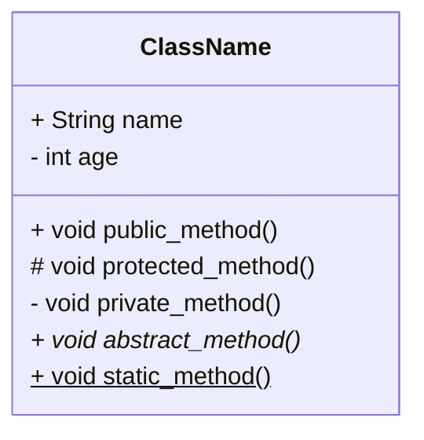
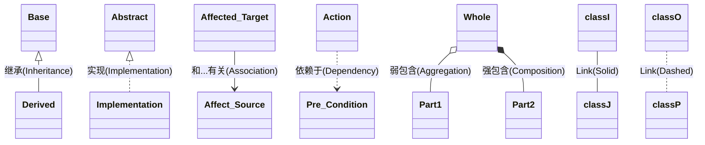

# Unified Modeling Language

## 类图

### 定义类

* 共三列: 类名; 属性; 函数
* \+ 表示 public
* \- 表示 private
* \# 表示 protected
* \* 表示抽象函数(虚函数)
* \$ 表示静态函数

### 类关系

箭头指向现有的对象类型
可以将对象名称写在连线上更直观查看关联对象

|relationship |desc
|- |-
|Inheritance    |继承: 指向父类
|Implementation |实现: 指向抽象类
|Association    |关联: 指向有关类
|Dependency     |依赖: 指向依赖源
|Aggregation    |聚合: 空心菱形连接整体(暗含指向部分)
|Composition    |组合: 实心菱形连接整体(暗含指向部分)

* 聚合: 表示整体和部分的弱相关关系，部分可以脱离整体，具有不同生命周期
* 组合: 表示整体和部分的强相关关系，一般有相同生命周期

