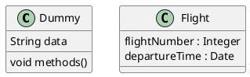
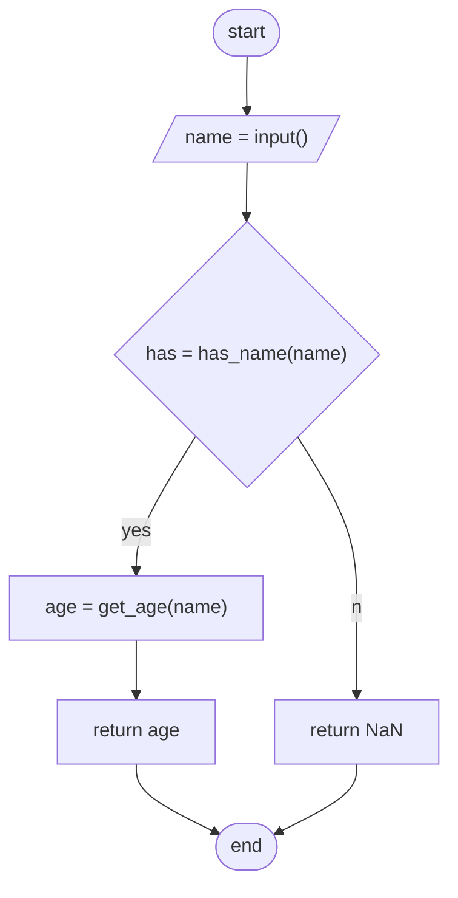
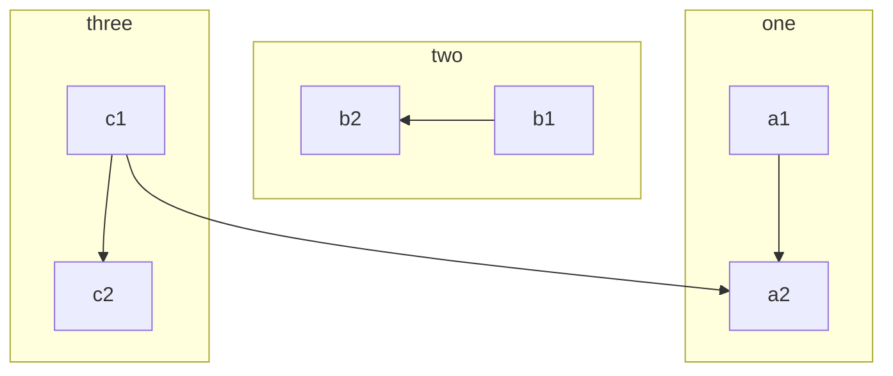

# markdown语法

[官方文档](https://markdown.com.cn/)

[数学公式](https://www.cnblogs.com/xiaostudy/p/16351659.html)

## markdownlint

[github](https://github.com/DavidAnson/markdownlint/tree/v0.28.2)

禁用rule方式查看github文档 Configuration

<!-- markdownlint-disable-next-line no-emphasis-as-heading -->
**禁用rule**

## 特殊字体

**加粗**效果

~~删除线~~

## 标题 {id="测试id"}

### 跳转到标题

[跳转到标题](#标题)

[跳转到id](#测试id)

### 跳转到其他文件标题

[test第一章第一节](./test.md#11-第一节)

此外还可以通过html标签来定义跳转位置

<a id="html-jump-mark"></a>

[跳转到html链接](#html-jump-mark)

## 格式

### 缩进

&emsp;全角
&ensp;半角
默认不缩进

## 数学公式

[数学公式](https://www.cnblogs.com/xiaostudy/p/16351659.html)

使用 $$ 将数学公式括起来

使用两组 $$ 就会创建代码块

|type | sample
|- |-
|加     | $a + b$
|减     | $a - b$
|乘     | $a * b$
|除     | $a / b$
|指数   | $a ^ b$
|下标   | $a_b$
|分数   | $\frac{a}{b}$
|向量   | $\vec{v}$

$$
\vec{v} = \begin{pmatrix}
1 \\
2 \\
3
\end{pmatrix}
$$

## 表格

| 左对齐 | 右对齐 | 居中对齐 |
| :-- | --: | :--: |
| 单元格单元格 | 单元格单元格 | 单元格单元格 |
| 单元格 | 单元格 | 单元格 <br> 换行 |

<table>
  <tr>
    <td colspan="2">合并行</td>
  </tr>
  <tr>
    <td>21</td>
    <td>22</td>
  </tr>
</table>

<table>
    <tr>
        <td rowspan="2">合并列</td>
        <td>12</td>
    </tr>
    <tr>
        <td>22</td>
    </tr>
</table>

## 列表

* 苹果
* 香蕉
* 樱桃

1. first
2. second
3. third

## 图

### UML类图

#### 安装

[graphviz下载链接](https://graphviz.org/download)

安装Markdown Preview Enhanced插件
按照 [官网](https://plantuml.com/zh/starting) 步骤安装java和graphviz-dot
添加环境变量 GRAPHVIZ_DOT=$GRAPHVIZ_INSTALL_DIR/bin/dot.exe
通过下面的代码块测试dot是否设置成功

```puml
testdot
```

#### plantuml 语法

[官网](https://plantuml.com/zh)

```puml
Object <|-- ArrayList

Object : bool equals();

ArrayList : Object[] elementData;
ArrayList : int size();
```



#### ditaa图

[官方介绍](https://plantuml.com/zh/ditaa)

[知乎用法一览](https://zhuanlan.zhihu.com/p/429506479)

```ditaa {cmd=true args=["-E"]}
        +-------+
        |       |
        |       | 
        +-------+
```

实现目录树效果

```ditaa {cmd=true args=["-E"]}
├─ dir1
|   ├─ a.txt
|   └─ b.txt
└─ dir2
    ├─ c.txt
    └─ d.txt
```

### mermaid

#### 流程图

[官方用法介绍](https://mermaid-js.github.io/mermaid/#/flowchart)

[在线编辑器](https://mermaid-js.github.io/mermaid-live-editor/edit)

```text
mermaid语法:
* graph TD表示竖向，横向使用graph LR
* var_name([var_value]): var_name为节点名称，var value为节点内容
  var_name不能是end
  var_value中如果有括号，使用双引号["var_value()"]
  var_value换行，[line1<br>line2<br>line3]
  节点样式:
    [] 方角矩形，如 name[value]
    () 弧度较小的圆角矩形
    {} 菱形
    (()) 圆
    ([]) 弧度较大的圆角矩形
    [()] 圆柱体
    [//] 平行四边形

* 可以先定义再连线，也可以定义的同时连线
```



subgraph



## 转pdf

* 借助 Chrome -> PDF
* [下载princexml](https://www.princexml.com/download/), 安装后将 engine/bin 添加到 Path

### 强制换页

<div style="page-break-before: always;"></div>

## mass

### 引用图片

方式一: 

方式二:

<div></div>

## tools

### markitdown

其他文件转 markdown

[github](https://github.com/microsoft/markitdown)

```sh
markitdown -c UTF-8 -o test.md test.pdf
```
