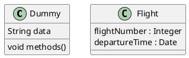

# 标题 {id="测试id"}

## 跳转到标题

[跳转到标题](#标题)

[跳转到id](#测试id)

此外还可以通过html标签来定义跳转位置

<a id="html-jump-mark"></a>

[跳转到html链接](#html-jump-mark)

# 表格

| 左对齐 | 右对齐 | 居中对齐 |
| :-- | --: | :--: |
| 单元格单元格 | 单元格单元格 | 单元格单元格 |
| 单元格 | 单元格 | 单元格 |

# 图

## UML类图

### 安装

安装Markdown Preview Enhanced插件
按照 https://plantuml.com/zh/starting 步骤安装java和graphviz-dot
添加环境变量 GRAPHVIZ_DOT=$GRAPHVIZ_INSTALL_DIR/bin/dot.exe
通过下面的代码块测试dot是否设置成功

```puml
testdot
```

### plantuml 语法

https://plantuml.com/zh/class-diagram

```puml
Object <|-- ArrayList

Object : bool equals();

ArrayList : Object[] elementData;
ArrayList : int size();
```


