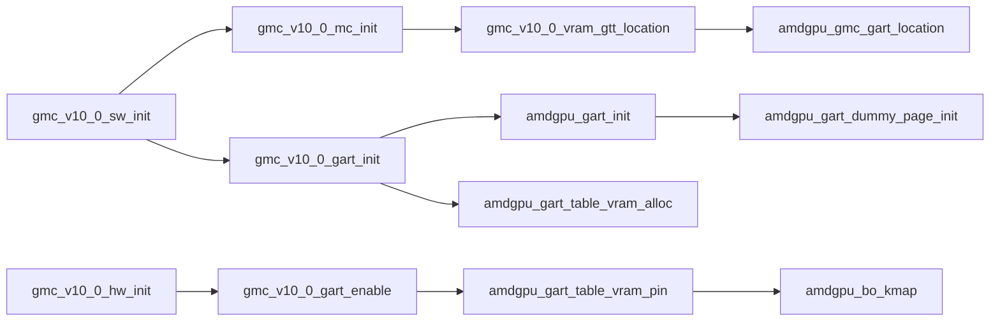
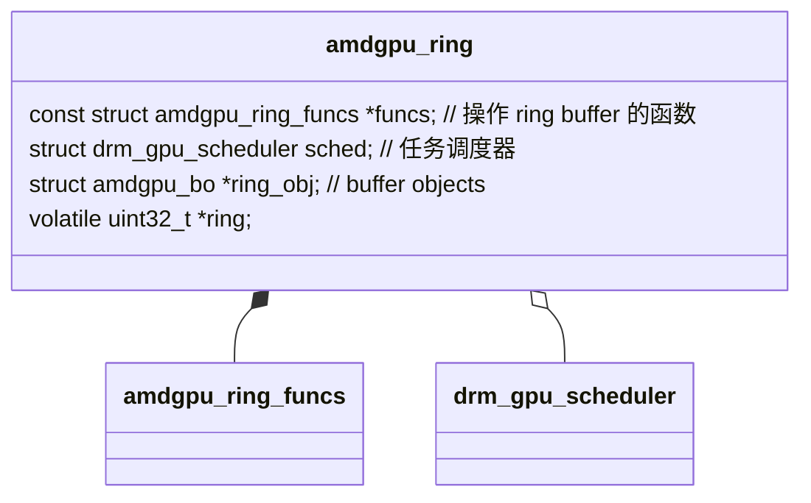

# amdgpu

[AMD search](https://www.amd.com/en/search/documentation/hub.html)
[Glossary](https://docs.kernel.org/gpu/amdgpu/amdgpu-glossary.html)
[drm/amdgpu AMDgpu driver](https://docs.kernel.org/gpu/amdgpu/index.html)
[amdgpu Dirver Notes](https://wiki.huangxt.cn/gpu/amdgpu-Driver-Notes)
[AMD GPU 手册](https://www.x.org/docs/AMD/old/R5xx_Acceleration_v1.5.pdf)
[AMD GPU 任务调度1 - 用户态](https://blog.csdn.net/huang987246510/article/details/106658889)
[AMD GPU 任务调度2 - 内核态](https://blog.csdn.net/huang987246510/article/details/106737570)
[AMD GPU 任务调度3 - fence 机制](https://blog.csdn.net/huang987246510/article/details/106865386)
[GPU submission strategies](https://gpuopen.com/presentations/2022/gpuopen-gpu_submission-reboot_blue_2022.pdf)

[Module Parameters](https://docs.kernel.org/gpu/amdgpu/module-parameters.html)

## Concepts

### MQD

* The AMD GPU has a unit called Command Processor (CP) in charge of driving work based on information provided by the driver. The MQD is an object in memory that describes the configuration of a compute queue. The firmware reads the state out of the MQD and puts it into a hardware slot when the queue is scheduled.
* When a queue is de-scheduled, the firmware saves the queue state from the hardware slot back to the MQD.

```sh
# 查看 gfx mqd 设置
sudo cat /sys/kernel/debug/dri/1/amdgpu_mqd_gfx_0.0.0 | xxd -c 4 -e
```

### SE, SH, CU

* SE(Shader Engine): 着色器引擎是GPU中的一个主要模块，负责处理图形和计算任务，每个 SE 包含多个 SH
* SH(Shader Array): 着色器阵列，是SE中的一个子模块。每个SE可以包含多个SH，每个SH又包含多个 CU(Compute Unit)
* 在 RDNA 架构中，一个 shader array 可能由多个 WGP(Workgroup Processor) 构成，而每个 WGP 又包含两个 CU

### TCC

Texture Cache Controller（纹理缓存控制器）。它是 GPU 中负责管理纹理数据缓存的关键硬件模块，主要用于优化纹理数据的访问效率，从而提升图形渲染和计算任务的性能。

* L1 Cache：每个计算单元（CU）都有自己的 L1 缓存，用于存储局部数据。
* L2 Cache：多个 CU 共享 L2 缓存，TCC 通常与 L2 缓存协同工作。
* 显存（VRAM）：当缓存未命中时，TCC 会从显存中加载纹理数据。

### Clock Gating

时钟门控是一种硬件级别的电源管理技术，通过动态关闭或启用某个硬件模块的时钟信号来降低功耗。

当需要节能时（如GPU空闲），调用 set_clockgating_state 函数启用时钟门控，关闭模块的时钟信号。

当模块需要工作时（如GPU进入高负载状态），调用此函数禁用时钟门控，恢复时钟信号。

每个IP模块（如GFX、UVD、VCN等）可能有自己的时钟门控实现，因此该函数的行为因硬件模块而异。

```sh
# 查看 clock-gating state
cat /sys/kernel/debug/dri/<N>/amdgpu_pm_info
```

### AMD KFD

[amdkfd](https://zhuanlan.zhihu.com/p/655989037)

AMD Kernel Fusion Driver 驱动用于支持 GPU 和 CPU 之间的协同工作，以实现异构系统架构（Heterogeneous System Architecture，HSA）

KFD 功能: 硬件抽象，内存管理，任务调度与执行，事件通知和同步，数据传输等

### APU

Accelerated Processing Unit 将 CPU，GPU 集成于同一芯片上的处理器，融合了 x86 处理器核心与 AMD 的图形核心（GPU 核心），通过统一的内存控制器和高速内部总线连接两者，让 CPU 和 GPU 能够更紧密协作、共享资源，打破了传统 CPU 与独立 GPU 之间数据传输的瓶颈。

### dummy page

在AMDGPU驱动中，dummy page（虚拟页/占位页） 是一个特殊的内存页面，用于在图形地址重映射表（GART）中充当占位符，确保系统在内存动态分配和释放时的稳定性和安全性。

1. 为什么需要dummy page？

* 防止非法访问：当GPU通过GART访问内存时，某些条目可能因内存释放或未分配而无效。若直接保留空指针或无效地址，GPU访问这些条目会导致崩溃或数据损坏。dummy page提供了一个安全的“虚拟”目标，所有无效的GART条目均指向此页，避免非法访问。
* 内存管理一致性：GPU内存管理需要动态分配和释放物理页（如显存或系统内存）。在页被释放后，GART条目不能立即清空（可能仍有未完成的操作），此时用dummy page填充，保持GART结构的完整性。
* 避免未初始化数据泄漏：dummy page通常被初始化为全零或固定值，防止通过无效地址读取到随机内存内容（可能包含敏感数据）。

### AGP

[agp-aperture-size](https://www.lenovo.com/us/en/glossary/agp-aperture-size)

AGP (Accelerated Graphics Port) aperture size is the amount of system memory allocated to the AGP for graphics operations. It serves as a buffer for the graphics card, allowing it to temporarily store textures and other graphical data. This allocation affects graphics performance by determining how much memory the graphics card can access, impacting tasks like rendering complex 3D graphics or high-resolution textures. Adjusting the aperture size can optimize performance based on system capabilities and application requirements.

### gang

gang 用于管理一组需要协同调度的GPU作业（jobs）。

1. Gang（作业组）的概念

* 协同调度需求：GPU任务（如计算、渲染）可能需要多个作业协同执行。例如，多个作业需共享资源、同步执行或按特定顺序提交。
* 原子性保障：通过将作业捆绑为gang，驱动确保它们被调度器视为一个整体，避免部分作业执行导致资源竞争或状态不一致。
* 硬件队列管理：某些GPU硬件可能要求相关作业必须提交到同一队列或按特定顺序处理，gang机制简化了这种复杂调度。

2. Gang Leader（领导者）的角色

* 调度协调：调度器可能优先处理gang_leader，其状态可能影响整个gang的调度（如阻塞或完成事件）。
* 同步点：其他作业可能依赖gang_leader的执行结果，例如通过硬件信号或软件同步机制。
* 资源管理：gang_leader可能负责分配共享资源（如内存、寄存器），确保组内作业一致性。
* 错误处理：若gang_leader执行失败，整个gang可能被标记为失败，触发统一回滚或恢复机制。

3. 典型应用场景

* 多队列依赖：如计算任务依赖渲染结果，需将两个作业捆绑为gang，确保渲染作业（gang_leader）先执行。
* 资源共享：多个作业共享同一缓冲区，通过gang确保它们被连续调度，避免中间插入其他作业导致资源冲突。
* 硬件约束：某些GPU架构要求特定操作序列必须原子提交，gang机制保证这些作业被整体处理。

4. 示例流程

用户提交一组作业 → 驱动创建gang并设置gang_size → 指定gang_leader及其索引 → 将作业填入jobs[]，绑定调度实体到entities[] → 调度器将gang作为单元处理，优先提交gang_leader → 根据硬件反馈更新整个gang状态。

### Swizzle Mode

A swizzle mode describes how a resources has its elements organized in memory and therefore specifies th method of calculating a virtual address from the Cartesian coordinate for accessing specific elements of an image/texture resource type.

```yml
surface             : 暂时理解为画布
element             : an element in a surface (usually a pixel)
element_bytes       : size of an element，对于 RGBA 颜色模式就是 4 字节
width_elements      : width of a 1D/2D/3D resource in elements(行像素数)
height_elements     : height of a 2D/3D resource in elements(列像素数)
depth_elements      : depth of a 3D resource in elements
blk_width           : width of a swizzle block in elements
blk_height          : height of a swizzle block in elements
blk_depth           : depth of a swizzle block in elements
blk_bytes           : size of swizzle block in bytes
width_pitch         : 暂时理解为每行像素数, = blk_width * ceil(width_elements / blk_width)
height_pitch        : 暂时理解为每列像素数, = blk_height * ceil(height_elements / blk_height)
depth_pitch         : 暂时理解为每列像素数, = blk_depth * ceil(depth_elements / blk_depth)
```

#### SW_LINEAR

```py
blk_bytes  = 256
blk_width  = blk_bytes / element_bytes
blk_height = 1
blk_depth  = 1

slice_size = width_pitch * height_pitch
address = base_address + (z * slice_size + (y * width_pitch + x)) * elements_bytes
```

#### SW_64KB_R_X

```py
blk_bytes     = 64KB = 65536
element_bytes = 4 (RGBA)
blk_width     = 128
blk_height    = 128
```

## amdgpu ring buffer

[PM4 packet format](https://www.jianshu.com/p/0eedbd58162b)
[PM4 packet spec-2011](https://www.amd.com/content/dam/amd/en/documents/radeon-tech-docs/programmer-references/evergreen_cayman_programming_guide.pdf)
[PM4 packet spec-2012](https://www.amd.com/content/dam/amd/en/documents/radeon-tech-docs/programmer-references/si_programming_guide_v2.pdf)

* amdgpu 使用 PM4 packet 作为 ring buffer 中数据的格式，PM4 packet 通过 PCIe bus 传递
* gfx 使用的是 type-3 类型

### fence

* fence 对象是共用的，但是有不同类型的 fence，通过 dma_fence_get 获取对象引用并增加引用计数
* 需要通过 amdgpu_ctx_add_fence 添加 fence，该函数会返回一个 sequence 表示当前 fence 编号，该编号是递增的
* 通过 PM4 packet 将 PACKET3 命令添加到 ring buffer 中时，会在最后添加一个 fence 命令(PACKET3_EVENT_WRITE_EOP)，该 fence 有一个 sequence 值
* GPU 执行该条指令时会将 seq 值写入命令中的地址，然后发送一个中断通知 CPU，CPU 获取地址中的 seq 值并于当前维护的 cur_seq 值比较，如果不一致说明执行了 fence，即有任务完成，然后发出 signal，解除 dma_fence_wait 函数的阻塞并调用通过 dma_fence_add_callback 注册的回调
* 记录 GPU 实际完成的 seq 的地址只有一个，当 seq 值和 cur_seq 不一致时，说明 [cur_seq, seq] 间的所有 fence 都已经执行

```c
// 将 fence 写入 ring 流程
amdgpu_ring_write(ring, PACKET3(PACKET3_EVENT_WRITE_EOP, 4));
amdgpu_ring_write(ring, EVENT_INDEX(5) | (exec ? EOP_EXEC : 0)));
amdgpu_ring_write(ring, addr & 0xfffffffc);
amdgpu_ring_write(ring, (upper_32_bits(addr) & 0xffff) | DATA_SEL(1) | INT_SEL(2));
amdgpu_ring_write(ring, lower_32_bits(seq));
amdgpu_ring_write(ring, upper_32_bits(seq));
```

#### fence_info

查看 fence 状态

```sh
sudo cat /sys/kernel/debug/dri/1/amdgpu_fence_info
```

## 内存管理

```c
GEM {               // 通过 GEM 与 user space 交互
    TTM {           // 将 GEN 转换为 TTM，实际使用 TTM 管理，GEM 只是接口
        AMDGPU_BO   // Buffer Object，实际的 buffer 内容
    }
}
```

### 虚拟内存 (VM)

查看 manual: **GPU VM Management**

Each VM has an ID associated with it and there is a page table associated with each VMID. When execting a command buffer, the
kernel tells the the ring what VMID to use for that command buffer. VMIDs are allocated dynamically as commands are submitted.
The userspace drivers maintain their own address space and the kernel sets up their pages tables accordingly when they submit
their command buffers and a VMID is assigned.

### GART



#### 创建 GART Table

##### 初始化 GTT

确定 GTT domain 的大小(gmc.gart_size)和地址范围(gmc.gart_start ~ gmc.gart_end)

```c
void amdgpu_gmc_gart_location(struct amdgpu_device *adev, struct amdgpu_gmc *mc) {
    adev->gmc.gart_size = 512 * 1024 * 1024;
    // GTT domain 地址范围通常在整个 GMC 地址范围的开头或末尾
    mc->gart_start = 0;
    mc->gart_start = max_mc_address - mc->gart_size + 1;

    // GART 起始地址要 4GB 对齐
    const uint64_t four_gb = 0x100000000ULL;
    mc->gart_start &= ~(four_gb - 1);
    mc->gart_end = mc->gart_start + mc->gart_size - 1;
}

// 打印 gpu_addr 验证是否在 [gart_start, gart_end]
// domain=AMDGPU_GEM_DOMAIN_GTT
int amdgpu_bo_create_kernel(struct amdgpu_device *adev,
            unsigned long size, int align,
            u32 domain, struct amdgpu_bo **bo_ptr,
            u64 *gpu_addr, void **cpu_addr) {
    amdgpu_bo_create_reserved(adev, size, align, domain, bo_ptr, gpu_addr, cpu_addr);
    if (gpu_addr) {
        printk("amdgpu_bo_create_kernel domain=%u, size=%lx, gpu_addr=%llx\n", domain, size, *gpu_addr);
    }
}
```

##### dummy dma_address

创建 dummy dma_address 作为 GART Table 中默认值，防止使用未申请的地址访问 GART Table 时获取到非法值，然后用非法值访问 system memory

```c
static int amdgpu_gart_dummy_page_init(struct amdgpu_device *adev) {
    struct page *dummy_page = ttm_glob.dummy_read_page;
    adev->dummy_page_addr = dma_map_page(&adev->pdev->dev, dummy_page, 0, PAGE_SIZE, DMA_BIDIRECTIONAL);
}
```

##### 为 GART Table 申请 vram

在 vram 上申请内存用于存储 GART Table

```c
// 每个 PTE 占 8 字节
// 对于 512M 的 gart_size，GART Table 本身大小为 512M / 4K * 8 = 1M
adev->gart.num_gpu_pages = adev->gmc.gart_size / AMDGPU_GPU_PAGE_SIZE;
adev->gart.table_size    = adev->gart.num_gpu_pages * 8;

// 在 vram 上为 GART Table 申请内存，维护在 adev->gart.bo 中
int amdgpu_gart_table_vram_alloc(struct amdgpu_device *adev) {
    struct amdgpu_bo_param bp;
    bp.size = adev->gart.table_size;
    bp.byte_align = PAGE_SIZE;
    bp.domain = AMDGPU_GEM_DOMAIN_VRAM;
    bp.flags = AMDGPU_GEM_CREATE_CPU_ACCESS_REQUIRED | AMDGPU_GEM_CREATE_VRAM_CONTIGUOUS;
    bp.type = ttm_bo_type_kernel;
    bp.bo_ptr_size = sizeof(struct amdgpu_bo);
    amdgpu_bo_create(adev, &bp, &adev->gart.bo);
}
```

##### 映射 Gart Table 到 cpu 地址

将 gart.bo 映射到 gart.ptr，使得 CPU 可以使用 gart.ptr 访问 GART Table

```c
int amdgpu_gart_table_vram_pin(struct amdgpu_device *adev) {
    amdgpu_bo_kmap(adev->gart.bo, &adev->gart.ptr);
}
```

##### 将 Gart Table 信息发送给 GPU

将 GTT domain 地址范围和 GART Table 起始地址通过寄存器发送给 GPU

```c
// 设置 GTT domain 地址范围
WREG32_SOC15(GC, 0, mmGCVM_CONTEXT0_PAGE_TABLE_START_ADDR_LO32, (u32)(adev->gmc.gart_start >> 12));
WREG32_SOC15(GC, 0, mmGCVM_CONTEXT0_PAGE_TABLE_START_ADDR_HI32, (u32)(adev->gmc.gart_start >> 44));
WREG32_SOC15(GC, 0, mmGCVM_CONTEXT0_PAGE_TABLE_END_ADDR_LO32,   (u32)(adev->gmc.gart_end   >> 12));
WREG32_SOC15(GC, 0, mmGCVM_CONTEXT0_PAGE_TABLE_END_ADDR_HI32,   (u32)(adev->gmc.gart_end   >> 44));

// 设置 GART Table 在 vram 中的地址
struct amdgpu_vmhub *hub = &adev->vmhub[AMDGPU_GFXHUB_0];
// 获取 GART Table PDE 在 vram 中的物理地址
// 由于 GART Table 是一个一级页表，所以 PDE 地址就是整个 GART Table 的入口
uint64_t pt_base = amdgpu_gmc_pd_addr(adev->gart.bo);
WREG32_SOC15_OFFSET(GC, 0, mmGCVM_CONTEXT0_PAGE_TABLE_BASE_ADDR_LO32, hub->ctx_addr_distance * vmid, lower_32_bits(page_table_base));
WREG32_SOC15_OFFSET(GC, 0, mmGCVM_CONTEXT0_PAGE_TABLE_BASE_ADDR_HI32, hub->ctx_addr_distance * vmid, upper_32_bits(page_table_base));
```

#### 使用 GART Table

##### 创建 BO 对象

当在 GTT domain 申请 BO 时，驱动会申请一个用于 dma 访问的 dma_address 和一个供 GPU 访问的虚拟地址 gpu_addr

```c
// 在 GTT 上创建 BO，domain 为 AMDGPU_GEM_DOMAIN_GTT
// gpu_addr 为 GPU 访问 system memory 的地址，这个地址需要经过 GART Table 转换为 dma_address
// cpu_addr 为 CPU 访问 system memory 的地址
int amdgpu_bo_create_kernel(struct amdgpu_device *adev, unsigned long size, int align, u32 domain,
                            struct amdgpu_bo **bo_ptr, u64 *gpu_addr, void **cpu_addr);
```

##### 更新 Gart Table

驱动将 gpu_addr 到 dma_address 的映射关系写入 GART Table

```c
// 当 CPU 写入 adev->gart.ptr 时，就是写入 vram 中的 GART Table，即更新 PTE
int amdgpu_gart_bind(struct amdgpu_device *adev, uint64_t offset, int pages, dma_addr_t *dma_addr, uint64_t flags) {
    return amdgpu_gart_map(adev, offset, pages, dma_addr, flags, adev->gart.ptr);
}

// 将在 GTT domain 上的 BO 记录到 GART Table 中
int amdgpu_gart_map(struct amdgpu_device *adev, uint64_t offset, int pages, dma_addr_t *dma_addr, uint64_t flags, void *dst) {
    unsigned t = offset / AMDGPU_GPU_PAGE_SIZE;
    for (unsigned i = 0; i < pages; i++) {
        uint64_t dma_address = dma_addr[i];
        for (unsigned j = 0; j < AMDGPU_GPU_PAGES_IN_CPU_PAGE; j++) {
            amdgpu_gmc_set_pte_pde(adev, dst, t, dma_address, flags);
            dma_address += AMDGPU_GPU_PAGE_SIZE;
            ++t;
        }
    }
}
```

##### GPU 访问 BO

当 GPU 接收到 gpu_addr 时，发现 gpu_addr 在 gart_start ~ gart_end 范围内，就会去查 GART Table，从而获取 dma_address，再用 dma_address 访问 system memory

##### 释放 BO

当释放 BO 后，从 GART Table 中解除映射关系，并映射到 dummy dma_address

```c
int amdgpu_gart_unbind(struct amdgpu_device *adev, uint64_t offset, int pages) {
    unsigned t = offset / AMDGPU_GPU_PAGE_SIZE;
    for (unsigned i = 0; i < pages; i++) {
        // 映射到 dummy dma_address，防止对这块地址进行访问（释放后理论上不应该再访问）
        u64 dma_address = adev->dummy_page_addr;
        for (unsigned j = 0; j < AMDGPU_GPU_PAGES_IN_CPU_PAGE; j++) {
            amdgpu_gmc_set_pte_pde(adev, adev->gart.ptr, t, u64 dma_address, flags);
            u64 dma_address += AMDGPU_GPU_PAGE_SIZE;
            ++t;
        }
    }
    // 刷新缓存
    amdgpu_device_flush_hdp(adev, NULL);
    for (i = 0; i < adev->num_vmhubs; i++)
        amdgpu_gmc_flush_gpu_tlb(adev, 0, i, 0);
}
```

#### KMD alloc GTT function_graph

```sh
amdgpu_bo_create_kernel BEGIN
  amdgpu_bo_create_reserved domain: 2, BEGIN
    amgpu_bo_create domain: 2, BEGIN
      ttm_bo_init_reserved BEGIN
        ttm_bo_validate BEGIN
          ttm_bo_alloc_resource BEGIN
            amdgpu_gtt_mgr_new BEGIN
              # 由 drm_mm_insert_node_in_range 分配地址
              ttm_resource_init
              amdgpu_gtt_mgr_new start: 7fffffffffffffff
            amdgpu_gtt_mgr_new END
            ttm_bo_alloc_resource new resource.start: 7fffffffffffffff
          ttm_bo_alloc_resource END
          ttm_bo_handle_move_mem new_use_tt: 1, BEGIN
            ttm_tt_populate BEGIN
              amdgpu_ttm_tt_populate BEGIN
                ttm_pool_alloc BEGIN
                  ttm_pool_alloc_page BEGIN
                    # use_dma_alloc = true，使用 dma_alloc_attrs 申请 dma 地址
                    ttm_pool_alloc_page dma_addr: 15bd00000, is_vmalloc: 0
                  ttm_pool_alloc_page END
                  ttm_pool_page_allocated BEGIN
                    # 将申请到的 page 和 dma_addr 绑定到 ttm_tt 对象
                    ttm_pool_map BEGIN
                    # amdgpu_bo.tbo->ttm->dma_address
                    ttm_pool_map END
                    # amdgpu_bo.tbo->ttm->pages
                  ttm_pool_page_allocated END
                ttm_pool_alloc END
                amdgpu_ttm_tt_populate dma_address: 15bd00000
              amdgpu_ttm_tt_populate END
            ttm_tt_populate END
            amdgpu_bo_move
          ttm_bo_handle_move_mem END
        ttm_bo_validate END
      ttm_bo_init_reserved END
      amdgpu_bo_create resource.start: 7fffffffffffffff
      # gpu_addr = start + gart_start
      amdgpu_bo_create gpu_addr: 7ffefffff000
    amgpu_bo_create END
    ttm_bo_validate
    ttm_bo_alloc_resource BEGIN
      amdgpu_gtt_mgr_new BEGIN
        ttm_resource_init
        amdgpu_gtt_mgr_new start: 900
      amdgpu_gtt_mgr_new END
      ttm_bo_alloc_resource new resource.start: 900
    ttm_bo_alloc_resource END
    # 更新 Gart Table
    amdgpu_ttm_gart_bind BEGIN
      amdgpu_gart_map BEGIN
        # 更新 pte
        amdgpu_gmc_set_pte_pde page offset: 900000
        amdgpu_gmc_set_pte_pde gpu_page_idex: 2304, dma_addr: 15bd00000
        amdgpu_gmc_set_pte_pde gpu_page_idex: 2305, dma_addr: 15bd01000
        ...
      amdgpu_gart_map END
    amdgpu_ttm_gart_bind END
    ttm_tt_populate
  amdgpu_bo_create_reserved END
amdgpu_bo_create_kernel END
```

#### UMD alloc GTT function_graph

```sh
# DRM_AMDGPU_GEM_CREATE
amdgpu_gem_create_ioctl BEGIN
  amdgpu_bo_create_user BEGIN
    amgpu_bo_create domain: 2, BEGIN
    # 创建 BO 流程和 KMD 相同
    amgpu_bo_create END
  amdgpu_bo_create_user END
  amgpu_gem_object_create gpu_addr: 7ffefffff000
amdgpu_gem_create_ioctl END
```

```sh
# DRM_AMDGPU_GEM_VA
amdgpu_gem_va_ioctl BEGIN
  amgpu_gem_va_ioctl gpu_addr: 7ffefffff000
  amgpu_gem_va_ioctl va_address: 100001000, offset_in_bo: 0
  amdgpu_vm_bo_map BEGIN, saddr: 100001000
  amdgpu_vm_bo_map END
  amdgpu_gem_va_update_vm BEGIN
    amdgpu_vm_bo_update BEGIN
      amdgpu_vm_update_range BEGIN
        # addr 是 dma_address，最终记录到 page table 的也是改地址
        # 该地址保存在 bo->tbo.ttm->dma_address 中
        amdgpu_vm_update_range cursor.start: 0, addr: 1034dd000
        amdgpu_vm_ptes_update start: 100001, dst: 1034dd000, BEGIN
          # 获取 page table 总起始地址
          amdgpu_vm_pt_start entry gpu_addr=80fecf9000
          # 申请 page table 节点(4 级 page table)
          # PDB2 (包含 512 个 PDB1 节点)
          amdgpu_vm_pt_alloc
          # PDB1 (包含 512 个 PDB0 节点)
          amdgpu_vm_pt_alloc
          # PDB0 (包含 512 个 PTB 节点)
          amdgpu_vm_pt_alloc
          # PTB (包含 512 个 PTE 节点)
          amdgpu_vm_pt_alloc
          amdgpu_vm_pte_update_flags BEGIN
            amdgpu_vm_pte_update_flags pe: 8, addr: 1034dd000
            amdgpu_vm_sdma_update pe: 8, addr: 1034dd000, BEGIN
              amdgpu_vm_sdma_set_ptes pe: 8, addr: 1034dd000, BEGIN
                # pe = PTB_gpu_addr + pte_index(8)
                # value = dma_addr | flags
                # 搜索 AMDGPU_PTE_VALID 查看有哪些 flags
                sdma_v5_2_vm_write_pte pe: 80fecf4008, value: 1034dd073
              amdgpu_vm_sdma_set_ptes END
            amdgpu_vm_sdma_update END
          amdgpu_vm_pte_update_flags END
        amdgpu_vm_ptes_update END
        amdgpu_vm_sdma_commit
      amdgpu_vm_update_range END
    amdgpu_vm_bo_update END
    # pde 在首次使用时也需要通过 amdgpu_vm_sdma_set_ptes 更新 page table
    amdgpu_vm_update_pdes
  amdgpu_gem_va_update_vm END
amdgpu_gem_va_ioctl END
```

### VRAM

#### vram manager 初始化

```c
// 获取 pcie BAR0（vram BAR）地址及大小，该地址经过映射后供 CPU 访问 vram
adev->gmc.aper_base = pci_resource_start(adev->pdev, 0);
adev->gmc.aper_size = pci_resource_len(adev->pdev, 0);
// 在 ttm 中映射 vram 地址空间
adev->mman.aper_base_kaddr = ioremap_wc(adev->gmc.aper_base, adev->gmc.visible_vram_size);

// 获取 vram 基地址，该地址是 GPU 访问 vram 时使用的地址
u64 base = RREG32_SOC15(GC, 0, mmGCMC_VM_FB_LOCATION_BASE);
adev->gmc->vram_start = base;

// 初始化 drm buddy system，buddy system 只需要知道 vram 大小即可
drm_buddy_init(&mgr->mm, man->size, PAGE_SIZE);
/* 如 4G 大小的 vram，可能被分成如下 blocks:
    buddy block 0: start=00000000, size: 80000000
    buddy block 1: start=80000000, size: 40000000
    buddy block 2: start=c0000000, size: 20000000
    buddy block 3: start=e0000000, size: 10000000
    buddy block 4: start=f0000000, size: 8000000
    buddy block 5: start=f8000000, size: 4000000
    buddy block 6: start=fc000000, size: 2000000
    buddy block 7: start=fe000000, size: 1000000
    当申请内存时，buddy system 会从最小的 block 查询剩余空间是否足够，如果足够就返回对应地址，注意这个地址需要加上 vram_start 才是 gpu 可用地址（mc_address）
*/
```

#### VM page table

```c
// 为 page table bo 申请 vram，此时对象中的地址是虚拟地址
int amdgpu_vm_pt_create(...);
adev->vm->root.bo;

// calculate vram buffer's physical address from MC address
uint64_t amdgpu_gmc_vram_mc2pa(struct amdgpu_device *adev, uint64_t mc_addr) {
    // 虚拟地址偏移加上物理基地址
    return mc_addr - adev->gmc.vram_start + adev->vm_manager.vram_base_offset;
}
```

#### KMD 向 vram domain 申请内存

```c
// ttm 会调用之前注册的 vram manager 回调函数(amdgpu_vram_mgr_new)申请 vram
// ttm_bo_alloc_resource
struct ttm_resource_manager *man = ttm_manager_type(bo->bdev, place->mem_type);
man->func->alloc(man, bo, place, res_ptr);

// amdgpu_vram_mgr_new 中调用 buddy system 申请内存
// 申请到的地址最终保存到 bo->tbo.resource->start
drm_buddy_alloc_blocks(...);
// 获取 gpu address 时需要加上 vram domain 基地址
gpu_addr = (bo->tbo.resource->start << PAGE_SHIFT) + amdgpu_ttm_domain_start(adev, TTM_PL_VRAM);
```

#### UMD 向 vram domain 申请内存

UMD 申请内存时不仅需要 KMD 的步骤，还需要将虚拟地址到物理地址的映射关系写入 page table

```c
// 1. UMD 通过 ioctl 申请 vram
// UMD 不能直接持有 gpu_addr，只能通过 handle 访问 BO
int amdgpu_bo_alloc(...) {
    drmCommandWriteRead(dev->fd, DRM_AMDGPU_GEM_CREATE,
&args, sizeof(args));
    u32 handle = args.out.handle;
}

// 2. UMD 通过 ioctl 更新 page table
// 申请虚拟地址，虚拟地址范围从 KMD gpu_info 获取，但分配完全由 libdrm 管理
amdgpu_va_range_alloc(...);
// amdgpu_bo_va_op(buf_handle, 0, size, *vmc_addr, 0, AMDGPU_VA_OP_MAP);
drmCommandWriteRead(dev->fd, DRM_AMDGPU_GEM_VA, &va, sizeof(va));

// 3. KMD 更新 vm page table
```

#### UMD alloc vram function_graph

##### amdgpu_vm_init

```sh
amdgpu_vm_init BEGIN
  amdgpu_vm_pt_create BEGIN
    amdgpu_bo_create_vm BEGIN
      amgpu_bo_create domain: 4, BEGIN
        ttm_bo_init_reserved BEGIN
          ttm_bo_validate BEGIN
            ttm_bo_alloc_resource BEGIN
              amdgpu_vram_mgr_new BEGIN
                ttm_resource_init
                amdgpu_vram_mgr_new drm_buddy_alloc_blocks fpfn: 0, lpfn: ff000000
                amdgpu_vram_mgr_new resource.start: fecf9
              amdgpu_vram_mgr_new END
              ttm_bo_alloc_resource new resource.start: fecf9
            ttm_bo_alloc_resource END
            ttm_bo_handle_move_mem new_use_tt: 0, BEGIN
              amdgpu_bo_move
            ttm_bo_handle_move_mem END
          ttm_bo_validate END
        ttm_bo_init_reserved END
        amdgpu_bo_create resource.start: fecf9
        amdgpu_bo_create gpu_addr: 80fecf9000
      amgpu_bo_create END
      amdgpu_bo_create_vm gpu_addr=80fecf9000
    amdgpu_bo_create_vm END
  amdgpu_vm_pt_create END
  amdgpu_vm_bo_base_init
  amdgpu_vm_pt_clear BEGIN
    ttm_bo_validate
    amdgpu_vm_pt_clear pe: 0, addr: 0
    amdgpu_vm_sdma_update pe: 0, addr: 0, BEGIN
      amdgpu_vm_sdma_set_ptes pe: 0, addr: 0, BEGIN
        # pde 全部置 0
        sdma_v5_2_vm_set_pte_pde pe: 80fecf9000, addr: 0, count: 512
      amdgpu_vm_sdma_set_ptes END
    amdgpu_vm_sdma_update END
    amdgpu_vm_sdma_commit BEGIN
    amdgpu_vm_sdma_commit END
  amdgpu_vm_pt_clear END
amdgpu_vm_init END
```

##### flush vm page table

注意: 在任务被提交到 scheduler 后才会刷新 page table

```sh
amdgpu_ib_schedule BEGIN
  amdgpu_vm_flush ring: gfx_0.0.0, BEGIN
    gfx_v10_0_ring_emit_vm_flush BEGIN
      gmc_v10_0_emit_flush_gpu_tlb ring: gfx_0.0.0, vmid: 1, pd_addr: fecf9001, BEGIN
        # 设置 page table 地址，reg 已经加上 GC 基地址，所以和头文件中不一致
        # mmGCVM_CONTEXT0_PAGE_TABLE_BASE_ADDR_LO32 + vmid * ctx_addr_distance
        # 0xfecf9001 中的 1 是 flag，即 val = gpu_addr | flags
        # 搜索 AMDGPU_PTE_VALID 查看有哪些 flags
        gfx_v10_0_ring_emit_wreg ring: gfx_0.0.0, reg: 28c9, val: fecf9001
        gfx_v10_0_ring_emit_wreg ring: gfx_0.0.0, reg: 28ca, val: 0
      gmc_v10_0_emit_flush_gpu_tlb END
    gfx_v10_0_ring_emit_vm_flush END
  amdgpu_vm_flush END
amdgpu_ib_schedule END
```

##### DRM_AMDGPU_GEM_CREATE

```sh
amdgpu_gem_create_ioctl BEGIN
  amdgpu_bo_create_user BEGIN
    amgpu_bo_create domain: 4, BEGIN
      ttm_bo_init_reserved BEGIN
        ttm_bo_validate BEGIN
          ttm_bo_alloc_resource BEGIN
            amdgpu_vram_mgr_new BEGIN
              ttm_resource_init
              # 由 drm buddy system 分配地址
              amdgpu_vram_mgr_new drm_buddy_alloc_blocks fpfn: 0, lpfn: ff000000
              amdgpu_vram_mgr_new resource.start: feadc
            amdgpu_vram_mgr_new END
            ttm_bo_alloc_resource new resource.start: feadc
          ttm_bo_alloc_resource END
          ttm_bo_handle_move_mem new_use_tt: 0, BEGIN
            amdgpu_bo_move
          ttm_bo_handle_move_mem END
        ttm_bo_validate END
      ttm_bo_init_reserved END
      amdgpu_bo_create resource.start: feadc
      gmc_v10_0_get_vm_pde
      # drm buddy system 分配的地址需要加上 vram_start
      amdgpu_bo_create gpu_addr: 80feadc000
    amgpu_bo_create END
  amdgpu_bo_create_user END
  amgpu_gem_object_create gpu_addr: 80feadc000
amdgpu_gem_create_ioctl END
```

##### DRM_AMDGPU_GEM_VA

```sh
amdgpu_gem_va_ioctl BEGIN
  amdgpu_gem_va_ioctl gpu_addr: 80feadc000
  amdgpu_gem_va_ioctl va_address: 100001000, offset_in_bo: 0
  amdgpu_vm_bo_map saddr: 100001000
  amdgpu_gem_va_update_vm BEGIN
    amdgpu_vm_bo_update BEGIN
      amdgpu_vm_ptes_update start: 100001, dst: feadc000, BEGIN
        # 获取 page table 总起始地址
        amdgpu_vm_pt_start entry gpu_addr=80fecf9000
        # 申请 page table 节点(4 级 page table)
        # PDB2 (包含 512 个 PDB1 节点)
        amdgpu_vm_pt_alloc
        # PDB1 (包含 512 个 PDB0 节点)
        amdgpu_vm_pt_alloc
        # PDB0 (包含 512 个 PTB 节点)
        amdgpu_vm_pt_alloc
        # PTB (包含 512 个 PTE 节点)
        amdgpu_vm_pt_alloc
        amdgpu_vm_pte_update_flags pe: 8, addr: feadc000
        amdgpu_vm_sdma_update pe: 8, addr: feadc000, BEGIN
          amdgpu_vm_sdma_set_ptes pe: 8, addr: feadc000, BEGIN
            # pe = PTB_gpu_addr + pte_index(8)
            # value = gpu_addr | flags
            # 搜索 AMDGPU_PTE_VALID 查看有哪些 flags
            sdma_v5_2_vm_write_pte pe: 80fecf4008, value: feadc071
          amdgpu_vm_sdma_set_ptes END
        amdgpu_vm_sdma_update END
      amdgpu_vm_ptes_update END
      amdgpu_vm_sdma_commit
    amdgpu_vm_bo_update END
    # pde 在首次使用时也需要通过 amdgpu_vm_sdma_set_ptes 更新 page table
    amdgpu_vm_update_pdes
  amdgpu_gem_va_update_vm END
amdgpu_gem_va_ioctl END
```

## CS (Command submit)

### 调度器数据结构

* **amdgpu_ring** (hardware ring) 中有一个任务调度器 **drm_gpu_scheduler**
* drm_gpu_scheduler 管理多个调度队列 **drm_sched_rq**
* drm_sched_rq 管理多个调度实体 **drm_sched_entity**，不同 entity 具有不同的优先级 drm_sched_priority
* drm_sched_entity 管理多个调度任务 **drm_sched_job**
* **amdgpu_job** 相当于继承了 drm_sched_job，增加了 **Indirect Buffer** 信息用来存储命令



```c
// 任务调度器，用于调度特定实例，每个 hardware ring 都有一个调度器
struct drm_gpu_scheduler {
    const struct drm_sched_backend_ops  *ops;           // 操作 job 的回调函数，用于提交 job 的是 ops->run_job
    u32                                 credit_limit;   // 能够同时提交的任务数量
    atomic_t                            credit_count;   // 已经提交的任务数量
    long                                timeout;        // 超时后从调度器移除 job
    const char                          *name;          // 该调度器操作的 ring buffer 名称
    u32                                 num_rqs;        // run-queues 数量
    struct drm_sched_rq                 **sched_rq;     // run-queues，每个 run-queue 有一个或多个 entity，每个 entity 有一个或多个 job
    wait_queue_head_t                   job_scheduled;  // 其他线程等待一个 entity 中所有 job 完成，完成后调度器会唤醒该线程
    atomic64_t                          job_id_count;   // 为每个 job 赋予一个唯一的 id
    struct workqueue_struct             *submit_wq;     // workqueue used to queue @work_run_job and @work_free_job
    struct workqueue_struct             *timeout_wq;    // workqueue used to queue @work_tdr
    struct work_struct                  work_run_job;   // work which calls run_job op of each scheduler
    struct work_struct                  work_free_job;  // work which calls free_job op of each scheduler
    struct delayed_work                 work_tdr;       // schedules a delayed call to @drm_sched_job_timedout after the timeout interval is over
    struct list_head                    pending_list;   // the list of jobs which are currently in the job queue
    spinlock_t                          job_list_lock;  // lock to protect the pending_list
    int                                 hang_limit;     // once the hangs by a job crosses this limit then it is marked guilty and 
                                                        // it will no longer be considered for scheduling.
    atomic_t                            *score;         // 选取空闲调度器时用于帮助负载均衡
    atomic_t                            _score;         // driver 不提供时使用的 score
    bool                                ready;          // 标记底层硬件是否 ready
    bool                                free_guilty;    // A hit to time out handler to free the guilty job
    bool                                pause_submit;   // pause queuing of @work_run_job on @submit_wq
    bool                                own_submit_wq;  // 当前调度器是否管理 @submit_wq 的内存
    struct device                       *dev;           // system &struct device
};
```

### CS 流程

|func |step
|- |-
|amdgpu_cs_parser_init  |init parser (amdgpu_device，drm_file，context等)
|amdgpu_cs_pass1        |获取或创建 entity;<br>遍历 chunks，创建 job，将渲染数据从用户态拷贝到内核态，设置 job 的 entity
|amdgpu_cs_pass2        |遍历 chunks，初始化 job->ibs
|amdgpu_cs_parser_bos   |设置 parser->bo_list
|amdgpu_cs_patch_jobs   |依据 bo_va_map 拷贝 job->ibs 数据
|amdgpu_cs_vm_handling  |
|amdgpu_cs_sync_rings   |同步 fence
|trace_amdgpu_cs_ibs    |tracing_fs 日志
|amdgpu_cs_submit       |
|--drm_sched_job_arm    |设置 job 的调度器及 s_fence 等
|--drm_sched_job_add_dependency |设置 job 依赖的 fence
|--amdgpu_ctx_add_fence |为 ctx 添加 fence，并将 handle 传回 UMD
|--amdgpu_cs_post_dependencies|
|amdgpu_cs_parser_fini  |清理工作，释放各种引用

1. 解析用户态渲染命令并存储到 chunks 中
初始化 job
从 chunks 中拷贝渲染命令到 IB 中
初始化 entity
将 job 加入 entity
GFX scheduler 选择一个 entity，以 FIFO 方式取出 job
执行 job->amdgpu_job_run，提交存放渲染命令的 IB

### 命令传递

CPU 和 GPU 的渲染命令传递通过 Ring Buffer 来实现

## module options

amdgpu_drv.c 中定义了类似下面这样的代码，表示能够在加载模块时指定参数

```c
/*
disable_cu          : insmod 时指定的参数名称
amdgpu_disable_cu   : 在 amdgpu_drv 中定义的变量
charp               : 数据类型为 char *，也可以是 uint 等
0444                : 该数据设置后访问权限，0444 表示只读
*/
MODULE_PARM_DESC(disable_cu, "Disable CUs (se.sh.cu,...)");
module_param_named(disable_cu, amdgpu_disable_cu, charp, 0444);
```

```sh
insmode amdgpu.ko disable_cu="0.0.0,0.0.1"  # 禁用指定编号的两个 CU
sudo dmesg | grep "amdgpu: disabling"       # 查看是否禁用
```

### amdgpu_fw_load_type

设置固件加载方式:

0: direct
1: psp
2: smu
3: rlc backdoor
-1: auto

### amdgpu_vm_update_mode

控制更新 page table 方式，2 bit，即取值范围为 [0, 3]，默认 -1 时会自动设置:

* 0: 使用 SDMA 更新
* 1: 使用 CPU 更新

```c
/* controls how VM page tables are updated for Graphics and Compute.
 * BIT0[= 0] Graphics updated by SDMA [= 1] by CPU
 * BIT1[= 0] Compute  updated by SDMA [= 1] by CPU
 */
int vm_update_mode;
```

### amdgpu_emu_mode

开发环境中的调试选项，默认为 0 表示关闭，设置为 1 表示开启

开启后:

* 跳过 power-gating, clock-gating
* 跳过 asic reset
* 跳过 golden registers 初始化
* 硬件 timeout *= 10
* 使用 direct 方式加载 gfx 固件时强制刷新 hdp

### amdgpu_discovery

设置获取包含硬件信息的 binary 的方式:

* 2: 从 amdgpu/ip_discovery.bin 中获取
* 非2: discover hardware IPs from IP Discovery table at the top of VRAM

### amdgpu_virtual_display

```c
/**
 * Set to enable virtual display feature. This feature provides a virtual display hardware on headless boards
 * or in virtualized environments. It will be set like xxxx:xx:xx.x,x;xxxx:xx:xx.x,x. It's the pci address of
 * the device, plus the number of crtcs to expose. E.g., 0000:26:00.0,4 would enable 4 virtual crtcs on the pci
 * device at 26:00.0. The default is NULL.
 */
```

### amdgpu_dpm

```c
/**
 * Override for dynamic power management setting
 * (0 = disable, 1 = enable)
 * The default is -1 (auto).
 */
```

## 寄存器

```yml
CP: Command Process 相关命令
```

```sh
sudo umr -r *.*.mm.*                # 查看所有寄存器
sudo umr -r *.*.mmCP.*              # 查看所有 CP 寄存器
```

amdgpu 中对寄存器的定义在 **drivers/gpu/drm/amd/include/asic_reg** 下，其中
offset.h 定义寄存器，
sh_mask.h 定义寄存器中各个字段对应位域(SHIFT + MASK)

```C
// 如 32 位寄存器中某个字段范围为 [11:8] 共占 4 位，则
// 读该字段时需要先使用 MASK(0xf00) 移除其他字段，再右移位 8 位
uint32_t val_r = (REG_R & MASK) >> SHIFT;
// 写该字段时需要左移位 8 位
uint32_t val_w = val_new << SHIFT;
uint32_t val_other = REG_R & ~MASK;
REG_W = (val_w | val_other);
```

|Name |File |Desc
|- |- |-
|mmCP_RB.*_BASE         |   |当前 ring buffer
|mmCP_IB.*_BASE         |   |当前 indirect buffer
|mmRLC_CNTL             |gc_10_3_0_sh_mask.h    |
|mmGRBM_STATUS          |sid.h                  |CP_BUSY,CB_BUSY,GPU_ACTIVE 等
|mmGRBM_STATUS2         |gc_10_3_0_sh_mask.h    |RLC_BUSY,CPG_BUSY 等
|mmGRBM_GFX_CNTL        | gc_10_3_0_sh_mask.h   |其中的 PIPEID,MEID,VMID,QUEUEID 表示当前选中的 queue

## debug

[GPU Debugging](https://docs.kernel.org/gpu/amdgpu/debugging.html)

### umr

[doc](https://umr.readthedocs.io/en/main/index.html)
[查看 fence 状态](#fence_info)

```sh
umr -c                                      # 查看显卡配置
umr -lb                                     # 查看当前显卡的 IP blocks

sudo umr --read *.*.mmUVD_CGC_.*            # 读取 register
sudo umr --read beige_goby.gfx1035.mmGRBM_STATUS$  # 读取指定 block 的指定寄存器，$ 可以防止读取 STATUS2
sudo umr --vm-read 0x1000 10 | xxd -e       # 读取 virtual memory
sudo umr --ring-stream gfx[0:9]             # 读取 gfx ring 前 10 个 dword
sudo umr --ring-stream gfx[.]               # 读取 gfx ring 中直到读指针位置的内容

sudo umr -w *.*.mmCP_RB_DOORBELL_RANGE_LOWER ff  # 设置指定寄存器的值
```

#### 读取 indirect buffer

```sh
# IB_BASE_HI, IB_BASE_LO: GTT 的虚拟内存地址
# IB_SIZE: 大小
# IB_VMID: 虚拟内存 id
Opcode 0x3f [PKT3_INDIRECT_BUFFER] (3 words, type: 3, hdr: 0xc0023f00)
|---> IB_BASE_LO=0x0, SWAP=0
|---> IB_BASE_HI=0x1
|---> IB_SIZE=16, IB_VMID=1, CHAIN=0, PRE_ENA=0, CACHE_POLICY=0, PRE_RESUME=0, PRIV=0
```

```sh
# umr -di <IB_VMID>@<IB_BASE_HI><IB_BASE_LO> <IB_SIZE>
sudo umr -di 0x1@0x100000000 16
```

#### 读写 GTT 内存

```sh
# 查看 VMID=1 的内存地址 0x100000400，长度为 4 字节
> sudo umr -vr 0x001@0x100000400 0x4 | xxd -e
# 不能显示为可见字符的 ascii 值显示为 .
00000000: 00000000                              ....
```

```sh
# 1 的 ASCII 码为 49，即 0x31
> echo 1111 | sudo umr -vw 0x001@0x100000400 0x4
> sudo umr -vr 0x001@0x100000400 0x4 | xxd -e
00000000: 31313131                             1111

# 借助 python 可以输入不可见字符
> python -c 'print(chr(0)*4)' | sudo umr -vw 0x001@0x100000400 0x4
> sudo umr -vr 0x001@0x100000400 0x4 | xxd -e
00000000: 00000000                             ....
```

## rgp

[download](https://gpuopen.com/rgp/)

```yml
rgp: Radeon GPU Profiler
rdp: Radeon Developer Panel
```

```sh
# 下载后解压即可直接使用
# help/rdp/index.html 中有关于 rdp 的介绍

# RadeonDeveloperPanel 是 rdp gui
# 0. 打开 gpu 后会动 connect 到本地
# 1. Available features 窗口的 ... 选择 Load Profiling
# 2. Applications 窗口的 ... 保持默认的 Any application 即可
# 3. System Information 窗口检查有没有 GPU 信息
# 4. 此时 Profiling 窗口显示 Status: Offline，表示没有使用 GPU 的进程
# 5. 运行使用 GPU 的程序，如 VulkanDemo
# 6. 此时 Profiling 窗口显示 Status: Ready
# 7. Profiling output path 面板设置 .rgp 记录文件路径
# 8. 点击 Capture 窗口的 Capture profile，生成 .rgp
# 9. 退出使用 GPU 的程序
./RadeonDeveloperPanel

# RadeonGPUProfiler 是 rgp gui
# Start -> Open 打开 rdp 生成的 .rgp 文件
./RadeonGPUProfiler
```
