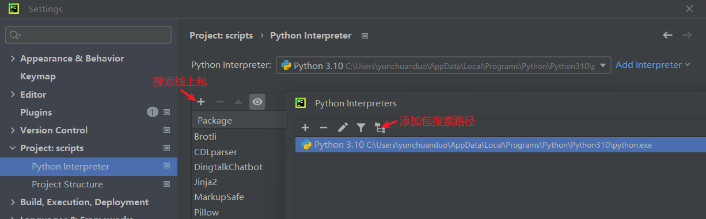

# pycharm

[插件官网](https://plugins.jetbrains.com)

## 启动失败

解决 Address already in use: bind 问题

```sh
# 以管理员身份运行
net stop winnat
net start winnat
```

## 设置python解释器, 安装包, 添加包搜索路径

```text
File -> settings -> Project: xxx -> Python Interpreter
下拉 -> show all
点击 + 添加解释器
    一般选择System Interpreter就可以 -> 选择python可执行文件路径
    (选择Virtualenv Environment可以分离不同项目使用的包)
```

新版本添加 pip 搜索路径方式变为

```txt
状态栏 Python Packages
点击 Add Package 前仿设置图标
添加 pip 源，并选择 Basic HTTP
```



## 修改vim设置

```text
~/.ideavimrc
```

```vimrc
set hlsearch
set incsearch

nnoremap <C-v> v
nnoremap v <C-v>
cnoremap <A-j> <Esc>
inoremap <A-j> <Esc>
```

覆盖vim代码跳转快捷键

```text
1. 打开设置，选择 Keymap
2. 搜索 forward/back，将 Navigate -> Forward/Back 改为 Ctrl + I/O
3. 选择 Editor->Vim，找到 Ctrl + I/O, handler 改为 IDE
```

## 其他快捷键及名称

* **Alt + H**   : 切换到左侧tab页(Editor Tabs -> Select Previous Tab)
* **Alt + L**   : 切换到右侧tab页(Editor Tabs -> Select Next Tab)
* **Ctrl + Tab**: 多个tab页选择
* **Alt + ]**   : 跳转到声明或引用(Go to Declaration or Usages)
* **Alt + O**   : 回退(Navigate -> Back)
* **Alt + I**   : 前进(Navigate -> Forward)
* **Ctrl + P**  : Go to File

## 显示内容

### 显示层级

设置中搜索 breadcrumbs 并勾选

### 自定义文件类型

Editor -> File Types -> 点击左上角加号

Keywords每个占一行，会有简单的高亮显示，如 [jinja 关键字](./库/jinja2.md#关键字)

## 插件

### Idea-Vim

Ctrl 组合键查看: Editor -> Vim

### python security

[检查描述](https://pycharm-security.readthedocs.io/en/latest/checks/index.html)

忽略指定类型检查: Alt + Enter -> Inspection -> Edit -> 取消勾选
