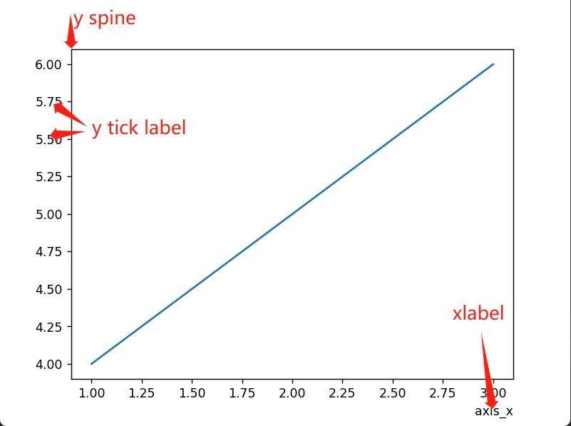
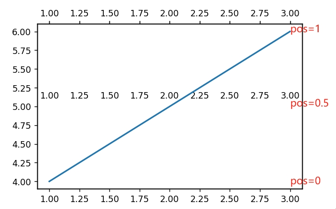

<!-- markdownlint-disable no-inline-html -->
# matplotlib

[官网](https://matplotlib.org/stable/index.html)

[github](https://github.com/matplotlib/matplotlib)

[菜鸟教程](https://www.runoob.com/matplotlib/matplotlib-tutorial.html)

[用法](https://blog.csdn.net/linxi4165/article/details/126086680)

## 快速查找

[官方示例](https://matplotlib.org/stable/gallery/index.html)

[图元素一览](https://matplotlib.org/stable/tutorials/introductory/quick_start.html#sphx-glr-tutorials-introductory-quick-start-py)

<a id='color-map'></a>
[颜色对照图](https://blog.csdn.net/qq_44901949/article/details/124738392)

[maker形状](https://matplotlib.org/stable/gallery/lines_bars_and_markers/marker_reference.html)

## 注意

* ```plg.show()``` 之后会自动将当前 Figure 对象设置为一个空 Figure，此时保存图片是空白的，通过 show 前后 ```print(id(plt.gcf()))``` 可以验证

## 基本(折线图为例)

[更详细画布中元素展示](https://matplotlib.org/stable/users/explain/quick_start.html)

<div></div>

* 画布: 单位为英寸，每英寸点个数为dpi，即分辨率，如 figsize=(8,6)表示8x6英寸, dpi=100表示每英寸有100个点

```python
import matplotlib.pyplot as plt
fig = plt.figure()
size = fig.get_size_inches()            # 画布尺寸
fig.dpi                                 # 画布分辨率(每英寸点数)

```

```python
import matplotlib.pyplot as plt

# 清空画布
plt.close()
# 自定义画布大小及清晰度
# figsize: 10英寸*10英寸
# dpi: 分辨率72(每英寸72个点)，默认：100
plt.figure(figsize=(10,10), dpi=72)

# 绘制折线图
plt.plot(list, list, color='r', linestyle='-', marker='o', markersize=8, label='test')
# plot可选参数
# color, linestyle(线样式), marker(点样式), label(标签, 调用legend才会显示)

# 设置图片标题
plt.title("test")

# 显示图例
plt.legend()

# 设置x/y轴刻度
# rotation: 旋转/倾斜角度，fontsize: 字号
plt.xticks(list, rotation=45, fontsize=10)
plt.yticks(list)
# 设置x/y轴名称
plt.xlabel("x")
plt.ylabel("y")

# 显示网格
plt.grid()

# 展示图片
plt.show()
# 保存图片
plt.savefig(path)

# 两条y轴
_, ax = plt.subplots()
x = list(range(10))
y = list(reversed(x))
line1 = ax.plot(x, y, marker='o', color='b', label="test1")[0]
ax.set_ylabel("y1", color='b')
ax2 = ax.twinx()
line2 = ax2.plot(x, x, marker='o', color='r', label="test2")[0]
ax2.set_ylabel("y2", color='r')
plt.legend(handles=[line1, line2])
plt.show()
```

## 图像

```python
# 设置有效内容页边距
subplots_adjust(left=None, bottom=None, right=None, top=None, wspace=None, hspace=None)
"""
left：  所有子图整体相对于图像的左外边距，距离单位为图像宽度的比例(float), 默认值0.125
right： 所有子图整体相对于图像的右外边距，距离单位为图像宽度的比例(float), 默认值0.0
bottom：所有子图整体相对于图像的下外边距，距离单位为图像高度的比例(float), 默认值0.11
top：   所有子图整体相对于图像的上外边距，距离单位为图像高度的比例(float), 默认值0.88
wspace：子图水平间距
hspace：子图竖直间距
"""
# 用法
matplotlib.figure.Figure.subplots_adjust(left=0.1)
matplotlib.pyplot.subplots_adjust(left=0.1)
```

## 柱状图

```python
fig, ax = plt.subplots(figsize=(18, 9))
colors = ['r', 'g', 'b']
# width: 表示柱宽所占比例，有效范围 (0,1]
# color: 柱状图会根据列表中颜色依次对柱状图着色, 每组颜色为color列表长度
columns = ax.bar(xTicks, values, width=barWidth, color=colors)
ax.bar_label(columns, padding=3)    # 柱状图上显示数值

# x, y: 和坐标轴单位相同
ax.text(x, y, text, fontSize=fs, ha="center", va="center")    # 单个位置显示text
```

## 3D

[3D图形展示](https://matplotlib.org/stable/users/explain/toolkits/mplot3d.html)

### plot_surface 平面图

```python
import matplotlib.pyplot as plt
import numpy as np
import math

# 创建一个 3D 图形窗口
fig = plt.figure()
ax = fig.add_subplot(111, projection='3d')

SIZE_X = 10
SIZE_Y = 5
# 创建网格数据
X = [i for i in range(SIZE_X)]
Y = [i for i in range(SIZE_Y)]
# 将两个一维数组组合成两个二维数组
# X Y 都变成 SIZE_Y 行 SIZE_X 列
X, Y = np.meshgrid(X, Y)
# z 轴数组长度需要和 x, y 轴对应
# Z = np.array([[3] * SIZE_X] * SIZE_Y)
Z = [[]] * SIZE_Y
for row in range(SIZE_Y):
    for col in range(SIZE_X):
        Z[-1].append(math.sqrt(X[col] ** 2 + Y[row] ** 2))
Z = np.array(Z)

# 绘制曲面图
surf = ax.plot_surface(X, Y, Z, cmap='viridis')

ax.set_xlabel('X Label')
ax.set_ylabel('Y Label')
ax.set_zlabel('Z Label')
# 显示颜色条
fig.colorbar(surf)
plt.show()
```

#### cmap 颜色映射选项

[颜色示例](https://matplotlib.org/stable/users/explain/colors/colormaps.html#colormaps)

|option | desc
|- |-
|viridis    | 从黄色到蓝色的颜色映射，适合用于连续数据
|plasma     | 从粉红色到紫色的颜色映射，适合用于连续数据
|inferno    | 从黄色到黑色的颜色映射，适合用于连续数据
|magma      | 从粉红色到黑色的颜色映射，适合用于连续数据
|cividis    | 从黄色到紫色的颜色映射，适合用于连续数据
|Greys      | 灰度颜色映射，从黑色到白色
|Blues      | 蓝色调颜色映射，从深蓝到浅蓝
|Reds       | 红色调颜色映射，从深红到浅红
|jet        | 经典的彩虹颜色映射，从蓝色到绿色到红色
|rainbow    | 彩虹颜色映射，从红色到黄色到蓝色
|coolwarm   | 冷暖颜色映射，从蓝色到白色到红色
|...        | 更多选项

## 坐标

坐标包括: x/y坐标轴(spine), 坐标刻度(ticks), 坐标名称(label)等

```python
# 获取Axes bounding box
import matplotlib.pyplot as plt
from matplotlib.widgets import Button
fig, ax = plt.subplots()
ax.plot([1, 2, 3], [4, 5, 6])

# Bbox(x0=0.125, y0=0.1, x1=0.9, y1=0.88)
# 即方框范围, (x0, y0)为左下角，(x1,y1)为右上角
# Bbox中 x/y取值范围为[0,1]，表示在整个图片中位置比例
bbox = ax.get_position()
left, bottom, right, top = bbox.x0, bbox.y0, bbox.x1, bbox.y1
width, height = 0.1, 0.05
Button(plt.axes([left, bottom, width, height]), "left-bot")
Button(plt.axes([right, top, width, height]), "right-top")
ax.set_xlabel('x\ny\nz', loc="right", labelpad=0)
# plt.subplots_adjust(bottom=0.5)
plt.show()
```

### 设置坐标轴名称

```python
Axes.set_xlabel(xlabel: str, fontdict=None, labelpad=None, *, loc=None, **kwargs)
"""
fontdict: 字典，示例: {'family': 'Times New Roman', 'weight': 'normal', 'size': 23}
labelpad: Spacing in points from the Axes bounding box including ticks and tick labels, default: 4.0 
loc: 坐标轴名称相对坐标轴的位置, 可取值 left/center/right, 默认为 center
"""
```

### 移动坐标轴位置

```python
matplotlib.spines.Spine.set_position(position: tuple(str, float))
"""
float为0表示不移动，为1表示移动到坐标框最上/右, 可为负值
"""
# 一般用法
# 设置刻度线及刻度值位置，bottom表示矩形框底部，top表示顶部
AxesSubplot.xaxis.set_ticks_position("bottom")
# 设置坐标轴名称位置
AxesSubplot.xaxis.set_label_position("bottom")
AxesSubplot.spines["bottom"].set_position(("axes", -0.15))   # 向下移动
```

### 设置坐标刻度

```python
Axes.set_xticks(ticks: list[float], labels: list[str]=None, *, minor=False, **kwargs)
"""
ticks: 坐标刻度
labels：每个刻度对应名称，如果不设置，直接使用刻度数值
"""

有些低版本可能只接受ticks一个参数，需要分开写:
ax.set_xticks(ticks)
# rotation: 倾斜角度，fontsize: 字号
ax.set_xticklabels(labels, rotation=45, fontsize=10)
```

### 新增y轴并向下移动

```python
sb = fig.add_subplot()
ax2 = sb.twiny()   # create a second axes
ax2.spines["bottom"].set_position(("axes", -0.15))   # move it down
ax.xaxis.set_ticks_position("bottom")
ax.xaxis.set_label_position("bottom")
ax2.set_xlabel("treatment", loc="right", labelpad=0)
```

### 其他

设置x轴坐标刻度值位置

<div></div>

```python
import matplotlib.pyplot as plt
# 设置x轴坐标刻度值位置
# pos 为相对矩形框位置，0表示不偏移，1表示刻度值显示到矩形顶部
def set_xtick_label_pos(ax: plt.Axes, pos: float):
    for tick in ax.get_xticklabels():
        assert isinstance(tick, plt.Text)
        tick.set_x(0)       # x轴方向不偏移
        tick.set_y(pos)     # 设置y值，即相对轴线偏移

# 多条x轴
fig, _ax = plt.subplots()
_ax2 = _ax.twiny()
_ax3 = _ax.twiny()
for tmp_ax, _pos in zip([_ax, _ax2, _ax3], [0, 0.5, 1]):
    tmp_ax.plot([1, 2, 3], [4, 5, 6])
    # 设置不同x轴刻度值(xtick-label)偏移量
    set_xtick_label_pos(tmp_ax, _pos)
set_xtick_label_pos(_ax, 0)
plt.show()
```

## Annotation

[官网介绍](https://matplotlib.org/stable/tutorials/text/annotations.html#plotting-guide-annotation)

### 实现group效果

<!-- markdownlint-disable-next-line no-inline-html -->
<div></div>

```python
def _addSingleGroupAnnotate(ax, groupName, xl, xr, y, padding):
    def annotate(left, right):
        ax.annotate(groupName,
                    xy=(left, y), xycoords='data',
                    xytext=(right, y - padding), textcoords='data',
                    annotation_clip=False, verticalalignment='top',
                    horizontalalignment='center', linespacing=2.0,
                    arrowprops=dict(arrowstyle='-', shrinkA=0, shrinkB=0,
                                    connectionstyle='angle,angleB=90,angleA=0,rad=5')
                    )
    mid = (xl + xr) / 2
    annotate(xl, mid)
    annotate(xr, mid)

def _addGroupAnnotates(cls, ax, annotatesInfo: [(str, float, float)], y: float, padding: float):
    """
    add group mark
    :param ax: AxesSubplot object
    :param annotatesInfo: [(groupName, startPos, endPos)]
    :param y: group mark height
    :param padding: distance to horizontal axis
    :return: None
    """
    for info in annotatesInfo:
        groupName, xl, xr = info
        cls._addSingleGroupAnnotate(ax, groupName, xl, xr, y, padding)


_, axe = plt.subplots()
annotates = [("group1", 0.1, 0.5), ("group2", 0.6, 0.95)]
yTicks = ax.get_yticks()
height = (yTicks[-1] - yTicks[0]) / 20
groupY, padding = yMin - height, height / 4
_addGroupAnnotates(axe, annotates, groupY, padding)
plt.show()
```

## 颜色

所有颜色查看[颜色对照图](#color-map)

默认配色: "C0" - "C9"

使用内置配色

```python
cmap = [
    plt.cm.Paired(1),plt.cm.Paired(6),plt.cm.Paired(2),plt.cm.Paired(3),plt.cm.Paired(4),plt.cm.Paired(5),
    plt.cm.Paired(0),plt.cm.Paired(7),plt.cm.Paired(8),plt.cm.Paired(9),plt.cm.Paired(10)
]
```

## 控件（Widgets）

### CheckButtons 复选框

通过勾选复选框动态设置不同正弦曲线可见性

```python
import numpy as np
import matplotlib.pyplot as plt
from matplotlib.widgets import CheckButtons

t = np.arange(0.0, 2.0, 0.01)
s0 = np.sin(2*np.pi*t)
s1 = np.sin(4*np.pi*t)
s2 = np.sin(6*np.pi*t)

fig, ax = plt.subplots()
l0, = ax.plot(t, s0, visible=False, lw=2, color='black', label='1 Hz')
l1, = ax.plot(t, s1, lw=2, color='red', label='2 Hz')
l2, = ax.plot(t, s2, lw=2, color='green', label='3 Hz')
fig.subplots_adjust(left=0.2)

lines_by_label = {lx.get_label(): lx for lx in [l0, l1, l2]}
line_colors = [lx.get_color() for lx in lines_by_label.values()]

# Make check buttons with all plotted lines with correct visibility
rax = fig.add_axes([0.05, 0.4, 0.1, 0.15])
check = CheckButtons(
    ax=rax,
    labels=list(lines_by_label.keys()),
    actives=[lx.get_visible() for lx in lines_by_label.values()],
    label_props={'color': line_colors},             # 3.7版本之后才支持 props
    frame_props={'edgecolor': line_colors},
    check_props={'facecolor': line_colors},
)


def callback(label: str):
    ln = lines_by_label[label]
    ln.set_visible(not ln.get_visible())
    ln.figure.canvas.draw_idle()


check.on_clicked(callback)

plt.show()
```
