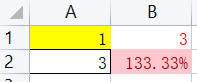

# openpyxl

[官方文档](https://openpyxl.readthedocs.io/en/stable/)

[字体,列宽,对齐,边框,填充](https://blog.csdn.net/qq_39147299/article/details/123378749)

## 注意事项

```text
1. 行的编号从 1 开始计数，如 ws.iter_rows的min_row参数最小值为 1
```

## 基础用法

查看版本

```python
import openpyxl
print(openpyxl.__version__)
```

### 读取 xlsx 文档

```python
import openpyxl
from openpyxl.workbook.workbook import Workbook
from openpyxl.worksheet.worksheet import Worksheet
from openpyxl.cell.cell import Cell

def print_excel_data(file_path):
    # 加载表格文件，如果添加 data_only=True 将自动计算表达式替换 Cell.value
    wb: Workbook = openpyxl.load_workbook(file_path)
    # 选择第一个工作表
    ws: Worksheet = wb.active
    # 根据名称选择指定 sheet 页
    ws: Worksheet = wb.get_sheet_by_name('Sheet1')

    # 按行遍历
    # min_row可以指定起始行号，最小为 1
    # values_only 为 True 表示只返回值，否则返回 Cell 对象
    for row in ws.iter_rows(min_row=1, values_only=True):
        cols = []
        for i in range(ws.max_column):
            # 直接获取到的数据可能是int, float等类型
            # 空白单元格和被合并的单元格(除左上角那个格子)返回 None
            cols.append(str(row[i]))
        print(" | ".join(cols))
```

### 写入 xlsx 文档

```python
import openpyxl

data = [['This is a test', 'Hello world', 'Python openpyxl'], ['Goodbye', 'World', 'Excel']]
wb = openpyxl.Workbook()
ws = wb.active
for row in data:
    ws.append(row)
wb.save("test.xlsx")
```

### sheet页

```python
ws = wb.create_sheet('sheet_name')      # 创建sheet页
ws.title = 'new_name'                   # 重命名sheet页

# 选择第一个工作表
ws: Worksheet = wb.active
# 根据名称选择指定 sheet 页
ws: Worksheet = wb.get_sheet_by_name('Sheet1')
```

### 从指定行列位置插入数据

```python
data = ['Data 1', 'Data 2', 'Data 3']

# 将数据插入到第二列开始的单元格
for index, value in enumerate(data, start=2):
    ws.cell(row=1, column=index, value=value)
```

### 条件格式

[设置条件格式(Conditional Formatting)](https://openpyxl.readthedocs.io/en/stable/formatting.html)

```python
# 根据数值所在区间设置背景颜色
# 如果打开已有条件格式的表格则无法应用新的条件格式
import openpyxl
from openpyxl.styles import PatternFill
from openpyxl.formatting.rule import CellIsRule

redFill = PatternFill(start_color='ffc7ce', end_color='ffc7ce', fill_type='solid')
greFill = PatternFill(start_color='c6efce', end_color='c6efce', fill_type='solid')

rule1 = CellIsRule(operator='<', formula=['30'], stopIfTrue=True, fill=redFill)
rule2 = CellIsRule(operator='between', formula=['30', '50'], stopIfTrue=True, fill=greFill)
rule3 = CellIsRule(operator='>', formula=['50'], stopIfTrue=True, fill=redFill)

wb = openpyxl.Workbook()
ws = wb.active
data = [[10, 20], [30, 40], [50, 60]]
for row in data:
    ws.append(row)

ws.conditional_formatting.add('A1:B3', rule1)
ws.conditional_formatting.add('A1:B3', rule2)
ws.conditional_formatting.add('A1:B3', rule3)

wb.save('test.xlsx')
```

## 对象

### Cell

#### 基础属性

```python
from openpyxl.cell.cell import Cell

# Cell 属性
Cell.row
Cell.column
Cell.value

# Cell 格式
Cell.font
Cell.fill
Cell.border
Cell.number_format
Cell.protection
Cell.alignment
Cell.style
Cell.quotePrefix
Cell.pivotButton

# 复制 Cell 格式时使用 copy.copy 即可
cell2.font = copy.copy(cell1.font)
```

#### 获取cell/访问cell

```python
# 方式一
for row in worksheet.rows:
    for cell in row:
        print(cell.value)

# 方式二
for i in range(1, worksheet.max_row + 1):
    for j in range(1, worksheet.max_column + 1):
        cell = worksheet.cell(i, j)

# 方式三
cell = worksheet["A1"]

# 方式四
for row in worksheet["A1:A3"]:  # 获取多个cell，tuple类型
    for cell in row:
        pass
```

#### 获取cell坐标

```python
cell.row: int           # 1
cell.column: int        # 1
cell.column_letter      # A
cell.coordinate         # A1
```

### 表达式

将单元格的值设为表达式

```python
ws['C2'] = '=A2+B2'
```

#### 单元格格式

```python
# 加粗字体
ws['B3'].font = Font(bold=True)
# 设置背景色
ws['B3'].fill = Font("solid", fgColor="00ffff")

# 修改行高
ws.row_dimensions[2].height = 20
# 修改列宽
ws.column_dimensions['A'].width = 50

# 对齐
from openpyxl.styles import Alignment
ws['B2'].alignment = Alignment(
    horizontal='left',      # 可选general、left、center、right、fill、justify、centerContinuous、distributed
    vertical='top',         # 可选top、center、bottom、justify、distributed
    text_rotation=0,        # 字体旋转，0~180整数
    wrap_text=False,        # 是否自动换行
    shrink_to_fit=False,    # 是否缩小字体填充
    indent=0,               # 缩进值
)
```

#### 边框

```python
from openpyxl.styles import Border, Side
style = Side(style="thin", color="000000")
cell.border = Border(top=style, right=style, bottom=style, left=style)
```

#### 数字格式

```python
from openpyxl.styles import numbers
# 设置为百分比格式
cell.number_format = numbers.FORMAT_PERCENTAGE_00

# 保留两位小数
cell.number_format = numbers.FORMAT_NUMBER_00

# 保留10位小数(小数位后面会自动补0到10位)
cell.number_format = '0.' + '0' * 10
```

## 实用函数

### is_cell_merged

判断cell是否被 merge

```python
def is_cell_merged(cell, worksheet):
    return cell.coordinate in cell.parent.merged_cells

def get_merged_cell(cell, worksheet):
    for cell_range in worksheet.merged_cells.range:
        if cell in cell_range:
            return cell_range

def print_excel_data(file_path):
    wb: Workbook = openpyxl.load_workbook(file_path)
    ws: Worksheet = wb.active
    for row in ws.iter_rows(min_row=1):
        for i in range(ws.max_column):
            cell: Cell = row[i]
            if is_cell_merged(cell, ws):
                print(f"merged: ({cell.row}, {cell.column})")
                print(cell.coordinate)      # A1, A2这种形式
```

### 自动适配单元格宽度及高度

如果字体在tkinter字体库中，可以使用 [tkinter](../%E5%B8%B8%E7%94%A8%E6%A8%A1%E5%9D%97.md#tkinter) 中的方法获取字符串宽度
如果有 **ttf** 字体文件，可以使用 [pillow](./PIL.md#get_text_width) 库获取字符串宽度

```python
from openpyxl.utils import get_column_letter
def adjust_width(ws: Worksheet):
    # 平均字符宽度系数（获取实际字符宽度需要加载字体库，不好确定字体库位置）
    CELL_WITH_MULTIPLE = 1.2    
    CELL_HEIGHT_MULTIPLE = 16
    MIN_CELL_WIDTH = 5          # 最小宽度
    MAX_CELL_WIDTH = 50         # 最大宽度
    widths = {}
    for row in ws.rows:
        for cell in row:
            if cell.value:
                cell_len = CELL_WITH_MULTIPLE * len(str(cell.value))
                widths[cell.column] = max((widths.get(cell.column, MIN_CELL_WIDTH), cell_len))
    for col, value in widths.items():
        ws.column_dimensions[get_column_letter(col)].width = min(value, MAX_CELL_WIDTH)
    
    # 适配宽度后适配高度
    for row in ws.rows:
        lineCnt = 1
        for cell in row:
            if cell.value and not is_cell_merged(cell, ws):
                value = str(cell.value)
                lineCnt = max(len(str(value)) // MAX_CELL_WIDTH + 1, lineCnt, value.count('\n') + 1)
        ws.row_dimensions[row[0].row].height = CELL_HEIGHT_MULTIPLE * lineCnt
```

### get_cell_range

根据坐标获取表格范围

```python
def get_cell_range(startRow: int, startCol: int, endRow: int, endCol: int) -> str:
    # 应用单元格包括 endRow 和 endCol
    # return: like A1:B3
    startColStr = get_column_letter(startCol)
    endColStr = get_column_letter(endCol)
    return f'{startColStr}{startRow}:{endColStr}{endRow}'
```

### 合并单元格

```python
# 合并 A1 到 C3 的单元格
ws.merge_cells('A1:C3')
ws.merge_cells(start_row=1, start_column=1, end_row=3, end_column=3)
```

### 单元格坐标转换

move_coordinate: copy 单元格时将原单元格中表达式的坐标 转换为新的坐标

```python
import re
from openpyxl import load_workbook


def _col_to_int(col: str) -> int:
    # 相当于 A-Z 的 26 进制, 其中 A -> 1, Z -> 26
    return sum([(ord(col[i]) - ord('A') + 1) * (26 ** (len(col) - i - 1)) for i in range(len(col))])


def _int_to_col(col: int) -> str:
    ret = []
    while col > 0:
        col, mod = divmod(col, 26)
        if mod == 0:
            mod = 26
            col -= 1
        ret.append(chr(mod + ord('A') - 1))
    return ''.join(reversed(ret))


# old_coord 坐标是相对于 A1 的，将其修改为相对于 new_start_coord 的坐标
# 如 old_coord = B2, 相对于 A1 行列都加 1, 则 start_coord = C3 时 return = D4
def move_coordinate(old_coord: str, new_start_coord: str) -> str:
    pat = re.compile('([A-Z]+)([0-9]+)')
    start_ret = pat.match(new_start_coord)
    i_start_col, i_start_row = _col_to_int(start_ret.group(1)), int(start_ret.group(2))
    ret = pat.match(old_coord)
    _new_col = _int_to_col(i_start_col + _col_to_int(ret.group(1)) - 1)
    _new_row = str(i_start_row + int(ret.group(2)) - 1)
    return f'{_new_col}{_new_row}'


c2i = {'A': 1, 'B': 2, 'Z': 26, 'AA': 27, 'AZ': 52, 'ZA': 677, 'ZZ': 702}
for key, val in c2i.items():
    assert _col_to_int(key) == val
    assert _int_to_col(val) == key

assert move_coordinate('A1', 'B1') == 'B1'
assert move_coordinate('B2', 'C3') == 'D4'
assert move_coordinate('AB6', 'AC10') == 'BD15'
# AB 到 A 距离等于 BD 到 AC 距离
assert _col_to_int('AB') - _col_to_int('A') == _col_to_int('BD') - _col_to_int('AC')
```

### copy_range

in.xlsx 内容及格式如下，其中 B2=(A1+A2)/B1，out.xlsx 用空的即可



```python
import re
import copy
from openpyxl import load_workbook
from openpyxl.worksheet.worksheet import Worksheet
from openpyxl.workbook.workbook import Workbook
from openpyxl.cell.cell import Cell
from openpyxl.worksheet.cell_range import MultiCellRange
from openpyxl.formatting.formatting import ConditionalFormattingList, ConditionalFormatting
from openpyxl.formatting.rule import Rule


def _col_to_int(col: str) -> int:
    # 相当于 A-Z 的 26 进制, 其中 A -> 1, Z -> 26
    return sum([(ord(col[i]) - ord('A') + 1) * (26 ** (len(col) - i - 1)) for i in range(len(col))])


def _int_to_col(col: int) -> str:
    ret = []
    while col > 0:
        col, mod = divmod(col, 26)
        if mod == 0:
            mod = 26
            col -= 1
        ret.append(chr(mod + ord('A') - 1))
    return ''.join(reversed(ret))


# old_coord 坐标是相对于 A1 的，将其修改为相对于 new_start_coord 的坐标
# 如 old_coord = B2, 相对于 A1 行列都加 1, 则 start_coord = C3 时 return = D4
def adapt_coordinate(old_coord: str, new_start_coord: str) -> str:
    pat = re.compile('([A-Z]+)([0-9]+)')
    start_ret = pat.match(new_start_coord)
    i_start_col, i_start_row = _col_to_int(start_ret.group(1)), int(start_ret.group(2))
    ret = pat.match(old_coord)
    _new_col = _int_to_col(i_start_col + _col_to_int(ret.group(1)) - 1)
    _new_row = str(i_start_row + int(ret.group(2)) - 1)
    return f'{_new_col}{_new_row}'


def adapt_coord_in_expression(exp: str, dst: str) -> str:
    def _tran(match_obj: re.Match) -> str:
        return adapt_coordinate(match_obj.group(0), dst)
    pat = re.compile('([A-Z]+)([0-9]+)')
    if isinstance(exp, str) and exp.startswith('='):
        return pat.sub(_tran, exp)
    return exp


def copy_range(src_sheet: Worksheet, src_range: str, dst_sheet: Worksheet, dst_coord: str, adapt_coord=True):
    # src_range: like A1:B2
    # dst_coord: like C3
    # 复制值及单元格格式
    src_cell_range = src_sheet[src_range]
    start_dst_cell = dst_sheet[dst_coord]
    start_row, start_col = start_dst_cell.row, start_dst_cell.column
    for i, row in enumerate(src_cell_range):
        for j, s_cell in enumerate(row):
            assert isinstance(s_cell, Cell)
            t_cell = dst_sheet.cell(row=start_row + i, column=start_col + j)
            t_cell.value = adapt_coord_in_expression(s_cell.value, dst_coord) if adapt_coord else s_cell.value
            t_cell.font = copy.copy(s_cell.font)
            t_cell.fill = copy.copy(s_cell.fill)
            t_cell.border = copy.copy(s_cell.border)
            t_cell.number_format = copy.copy(s_cell.number_format)
            t_cell.protection = copy.copy(s_cell.protection)
            t_cell.alignment = copy.copy(s_cell.alignment)
            t_cell.quotePrefix = copy.copy(s_cell.quotePrefix)
            t_cell.pivotButton = copy.copy(s_cell.pivotButton)
            # t_cell.style = copy.copy(s_cell.style)    # style 不能复制
    # 复制条件格式
    src_range = MultiCellRange(src_range)

    src_formatting: ConditionalFormattingList = src_sheet.conditional_formatting
    dst_formatting: ConditionalFormattingList = dst_sheet.conditional_formatting
    for cond_fmt in src_formatting:
        assert isinstance(cond_fmt, ConditionalFormatting)
        fmt_ranges: MultiCellRange = cond_fmt.cells
        dst_fmt_ranges = []
        for coord_range in str(fmt_ranges).split():
            if ':' in coord_range:
                coord1, coord2 = coord_range.split(':')
            else:
                coord1, coord2 = coord_range, coord_range
            if coord1 in src_range and coord2 in src_range:
                dst_range = adapt_coordinate(coord_range, dst_coord)
                if src_formatting is dst_formatting:    # 复制到当前文件
                    fmt_ranges.add(dst_range)
                else:                                   # 复制到不同文件
                    dst_fmt_ranges.append(dst_range)
        if dst_fmt_ranges:
            for rule in cond_fmt.cfRule:
                assert isinstance(rule, Rule)
                dst_formatting.add(' '.join(dst_fmt_ranges), rule)


wb = load_workbook('in.xlsx')
wb2: Workbook = load_workbook('out.xlsx')
copy_range(wb.active, 'A1:B2', wb2.active, 'C3')
wb2.save('out.xlsx')
```
