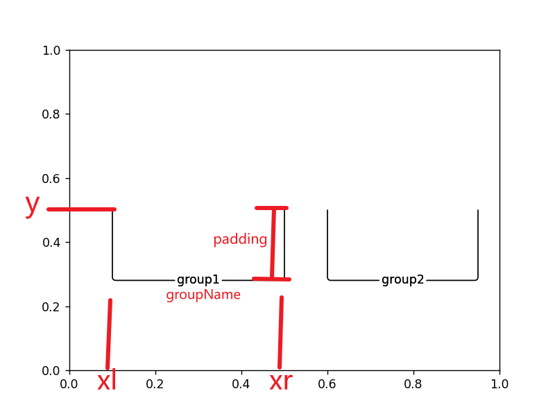

# matplotlib

[官网](https://matplotlib.org/stable/index.html)

```python
# 设置有效内容页边距
subplots_adjust(left=None, bottom=None, right=None, top=None, wspace=None, hspace=None)
"""
left：  所有子图整体相对于图像的左外边距，距离单位为图像宽度的比例(float), 默认值0.125
right： 所有子图整体相对于图像的右外边距，距离单位为图像宽度的比例(float), 默认值0.0
bottom：所有子图整体相对于图像的下外边距，距离单位为图像高度的比例(float), 默认值0.11
top：   所有子图整体相对于图像的上外边距，距离单位为图像高度的比例(float), 默认值0.88
wspace：子图水平间距
hspace：子图竖直间距
"""
# 用法
matplotlib.figure.Figure.subplots_adjust(left=0.1)
matplotlib.pyplot.subplots_adjust(left=0.1)
```

## 坐标

坐标包含概念: 坐标轴(spine), 坐标刻度(ticks), 坐标名称(label)

### 设置坐标轴名称

```python
Axes.set_xlabel(xlabel: str, fontdict=None, labelpad=None, *, loc=None, **kwargs)
"""
labelpad: 坐标轴名称到坐标轴刻度下/右边缘垂直距离, 默认为 4.0, 可取负值, 单位是像素？
loc: 坐标轴名称相对坐标轴的位置, 可取值 left/center/right, 默认为 center
"""
```

### 移动坐标轴位置

```python
matplotlib.spines.Spine.set_position(position: tuple(str, float))
"""
float为0表示不移动，为1表示移动到坐标框最上/右, 可为负值
"""
# 一般用法
AxesSubplot.xaxis.set_ticks_position("bottom")
AxesSubplot.xaxis.set_label_position("bottom")
AxesSubplot.spines["bottom"].set_position(("axes", -0.15))   # 向下移动
```

### 设置坐标刻度

```python
Axes.set_xticks(ticks: list[float], labels: list[str]=None, *, minor=False, **kwargs)
"""
ticks: 坐标刻度
labels：每个刻度对应名称，如果不设置，直接使用刻度数值
"""

有些低版本可能只接受ticks一个参数，需要分开写:
ax.set_xticks(ticks)
ax.set_xticklabels(labels)
```

### 新增y轴并向下移动

```python
sb = fig.add_subplot()
ax2 = sb.twiny()   # create a second axes
ax2.spines["bottom"].set_position(("axes", -0.15))   # move it down
ax.xaxis.set_ticks_position("bottom")
ax.xaxis.set_label_position("bottom")
ax2.set_xlabel("treatment", loc="right", labelpad=0)
```

## Annotation

[官网介绍](https://matplotlib.org/stable/tutorials/text/annotations.html#plotting-guide-annotation)

### 实现group效果

<div></div>

```python
def _addSingleGroupAnnotate(ax, groupName, xl, xr, y, padding):
    def annotate(left, right):
        ax.annotate(groupName,
                    xy=(left, y), xycoords='data',
                    xytext=(right, y - padding), textcoords='data',
                    annotation_clip=False, verticalalignment='top',
                    horizontalalignment='center', linespacing=2.0,
                    arrowprops=dict(arrowstyle='-', shrinkA=0, shrinkB=0,
                                    connectionstyle='angle,angleB=90,angleA=0,rad=5')
                    )
    mid = (xl + xr) / 2
    annotate(xl, mid)
    annotate(xr, mid)


def _addGroupAnnotates(ax, annotatesInfo: [(str, float, float)], y: float, padding: float):
    for info in annotatesInfo:
        groupName, xl, xr = info
        _addSingleGroupAnnotate(ax, groupName, xl, xr, y, padding)


_, axe = plt.subplots()
annotates = [("group1", 0.1, 0.5), ("group2", 0.6, 0.95)]
_addGroupAnnotates(axe, annotates, 0.5, 0.2)
plt.show()
```
