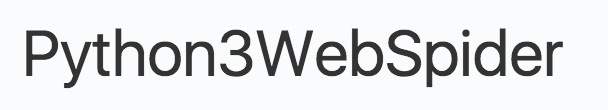

# tesseract

[github](https://github.com/tesseract-ocr/tesseract)

[windows安装包](https://digi.bib.uni-mannheim.de/tesseract/)

测试图片



用法示例

```bash
tesseract <example.png> <output_file>
```

[使用python调用](../../program_language/python/%E5%BA%93/pytesseract.md)
